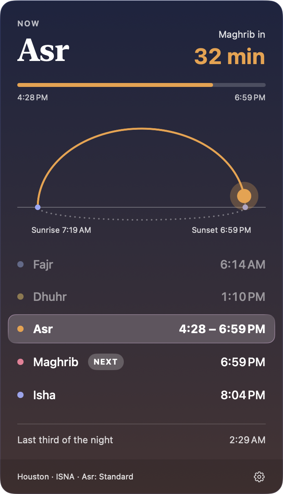

# Falah

**Falah** (فلاح, "success", from the adhan's *ḥayya ʿalā l-falāḥ*: come to success) is a small native macOS menu bar app for the five daily prayers.

It sits in your menu bar as a sun, a sunset or a moon, with the time of the next prayer beside it. Hover it and a card drops down with the sun's path across the day, today's prayer times and a live countdown. The card is tinted to match the sky outside.

<p align="center">
  
</p>

## Features

- **Menu bar:** a sun (Fajr to Asr), sunset (Maghrib) or moon (Isha), with "Maghrib in 32m" under an hour or "Maghrib 6:59 PM" otherwise. It follows light and dark menu bars.
- **Card:** opens on hover or click and never steals focus from the app you're in.
  - The current prayer with a countdown and a progress bar.
  - The sun's path from sunrise to sunset; at night the moon moves below the horizon.
  - Today's prayer times. The current prayer shows its range, the next one is marked, and earlier ones are dimmed.
  - The last third of the night.
- **Sky colours:** dawn, day, sunset and night backgrounds that blend smoothly into each other, with stars at night.
- **Liquid Glass:** on macOS 26 the card uses Apple's Liquid Glass, tinted with the sky. You can switch back to the solid sky card in Settings.
- **Prayer moment:** at each prayer the menu bar item flashes (in a colour you choose) and a silent notification arrives: *It's time for Asr · 4:28 PM*. There's an optional reminder before each prayer.
- **Settings:**
  - Location: automatic, or a typed city or coordinates.
  - Calculation method (ISNA by default, plus Muslim World League, Umm al-Qura, Egyptian, Karachi and more).
  - Asr: Standard or Hanafi.
  - High-latitude rule.
  - Per-prayer adjustments of up to ±10 minutes to match your local masjid.
  - Liquid Glass card on or off (macOS 26).
  - Launch at login.
- **Light on battery:** it updates once a minute, on the minute. It has no per-second timers, and its animations only run while the card is open.

Prayer times are calculated on your Mac with [Adhan Swift](https://github.com/batoulapps/adhan-swift). Nothing is sent anywhere. Your location is only used to calculate the times, and to look up your city's name for display.

## Install

1. Download `Falah.zip` from the [latest release](../../releases/latest) and unzip it.
2. Move `Falah.app` to your Applications folder.
3. Open it. Falah isn't notarized by Apple yet, so macOS will block it the first time:
   - Open **System Settings → Privacy & Security**.
   - Scroll down to the message about Falah and click **Open Anyway**, then confirm.

   You only need to do this once.
4. Allow **Location** (so times match where you are) and **Notifications** (for prayer alerts) when asked. Falah works without either: you can type your city in Settings instead.

Requires macOS 14 Sonoma or later, on Apple silicon or Intel.

## Accuracy

Different communities use different calculation methods. Before relying on Falah, compare a few days against your local masjid's timetable. Then pick the matching method in Settings, and turn on **Adjust times for my masjid** if you need to shift any prayer by a few minutes.

## Build from source

You only need Apple's Command Line Tools (`xcode-select --install`). Xcode isn't required.

```sh
scripts/test.sh          # unit tests (Swift Testing)
scripts/build-app.sh     # builds and ad-hoc signs build/Falah.app
open build/Falah.app
scripts/make-release.sh  # universal (Apple silicon + Intel) build, zipped to build/Falah.zip
```

Use `scripts/test.sh` rather than bare `swift test`. With only the Command Line Tools installed, SwiftPM can't find the Swift Testing framework on its own; the script passes the path.

### Testing prayer moments

Hidden launch arguments fake the clock, so you don't have to wait for a prayer:

```sh
open build/Falah.app --args --debug-time 2026-10-08T16:27:45            # 15 s before Asr
open build/Falah.app --args --debug-time 2026-10-08T05:30 --debug-speed 300 --show-card   # watch a day in ~5 min
open build/Falah.app --args --debug-place "Houston:29.7604:-95.3698" --show-card       # fixed place, not saved
```

`--show-settings` opens the Settings window at launch.

Logs: `log stream --predicate 'subsystem == "com.yusufkhan.falah"'`

### Project layout

```
Sources/Falah/
  App/        AppDelegate (lifecycle, refresh loop), StatusItemController (menu bar item)
  Model/      PrayerEngine (all prayer logic, no UI), SkyPalette, MenuBarText, Settings, Clock
  Services/   Scheduler (minute timer, wake/day/time zone/clock changes), LocationService, Notifier
  UI/         PopoverPanel (non-activating NSPanel), SkyCardView, ArcView, SettingsView, MenuBarIcon
Tests/FalahTests/
```

## License

[MIT](LICENSE) © 2026 Yusuf Khan
